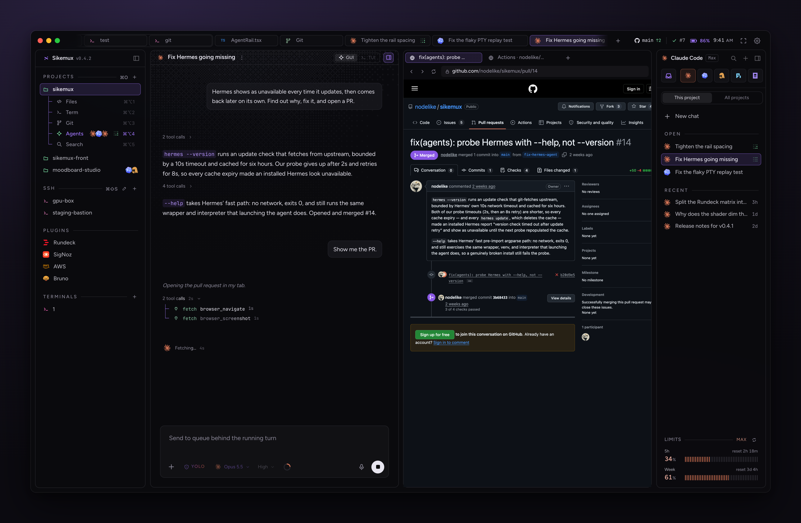

<div align="center">

# Sikemux

**A terminal workspace for you and your coding agents.**

Bring Claude Code, Codex or OpenCode. Sikemux gives them your shell, browser, logs and deploys, in one 13 MB native app.



[](https://github.com/nodelike/sikemux/releases/latest)
[](https://discord.gg/UKfmHpF9kX)
[](https://sikemux.com)

</div>

## Install

Download the latest `.dmg` from [sikemux.com](https://sikemux.com) or [Releases](https://github.com/nodelike/sikemux/releases/latest). It is about 13 MB, needs macOS 11 or later on Apple Silicon, and keeps itself up to date.

## What's inside

- **Projects** with a code editor, terminals, Git, and search, all in one working directory
- **Coding agents**: Claude, Codex, Hermes, Pi and OpenCode, several at once, each with its own browser tabs, and one list of every agent and recent chat across your open projects
- **Chats that know your work**: `@` attaches project files, `#` hands over GitHub or Bitbucket issues and pull requests, and an optional worktree gives a chat its own branch. Terminal selections, problems, logs and pull request lines can be sent to any agent
- **Nothing stops when you quit**: terminals, agents and tasks keep running in the background and come back where they were. Quit and Stop Everything (`⌥⌘Q`) ends them
- **Panels** for AWS, GitHub, Bitbucket, Rundeck, SigNoz and Bruno
- **SSH** sessions, nine themes and a custom theme editor

The [website](https://sikemux.com) has the full tour.

## Project config

Check a `sikemux.json` into a project to add actions, tasks, and a preview to the command deck (`⌘⇧P`). Sikemux shows each command and asks before running it.

```json
{
  "version": 1,
  "actions": [
    {
      "id": "check",
      "label": "Run checks",
      "command": "pnpm check",
      "placement": "terminal",
      "contexts": ["project"]
    }
  ],
  "tasks": [{ "id": "dev", "label": "Dev server", "command": "pnpm dev" }],
  "preview": { "url": "http://localhost:5173", "command": "pnpm dev" }
}
```

Agents can start, read, and stop these tasks through Sikemux's MCP tools or the `sikemux tool` CLI. Tasks and their runs live in Sikemux's background process, so agents can read and stop them, and wait on their events, while the window is closed. [`browser/SIKEMUX_GUIDE.md`](browser/SIKEMUX_GUIDE.md) describes the protocol.

## CLI

Install the `sikemux` launcher from Settings → CLI.

```bash
sikemux .
sikemux src/App.tsx:42:5
EDITOR=sikemux-editor git commit
```

## Shortcuts

| Key   | Action                        |     | Key   | Action                   |
| ----- | ----------------------------- | --- | ----- | ------------------------ |
| `⌘N`  | New agent                     |     | `⌘T`  | New terminal             |
| `⌘⇧N` | Choose or resume an agent     |     | `⌘D`  | Split pane               |
| `⌘J`  | Show or hide the agent's desk |     | `⌘P`  | Open file                |
| `⌘O`  | Open project                  |     | `⌘⇧P` | Command deck             |
| `⌘⇧S` | Connect to an SSH host        |     | `⌘,`  | Settings                 |
| `⌘Q`  | Quit, leaving work running    |     | `⌥⌘Q` | Quit and Stop Everything |

Settings → Keybindings lists and rebinds every shortcut.

## Build from source

You need [Rust](https://www.rust-lang.org/tools/install), Node.js 22+, and [pnpm](https://pnpm.io/).

```bash
git clone git@github.com:nodelike/sikemux.git
cd sikemux
pnpm install
make dev     # hot reload, runs beside the installed app
make build   # Apple Silicon app and DMG
make check   # every quality gate
```

[CONTRIBUTING.md](CONTRIBUTING.md) covers the project layout and checks. [docs/releasing.md](docs/releasing.md) covers publishing.

## Community

Ask for help and follow releases on [Discord](https://discord.gg/UKfmHpF9kX). Issues and pull requests are welcome.

## License

[FSL-1.1-MIT](LICENSE) © nodelike

Sikemux is free to use, modify and self-host, at home or at work. You may not offer it, or a fork of it, as a competing product. Each release becomes MIT two years after it ships.

"Sikemux" and its logo are trademarks of nodelike. Forks must use a different name and logo.
